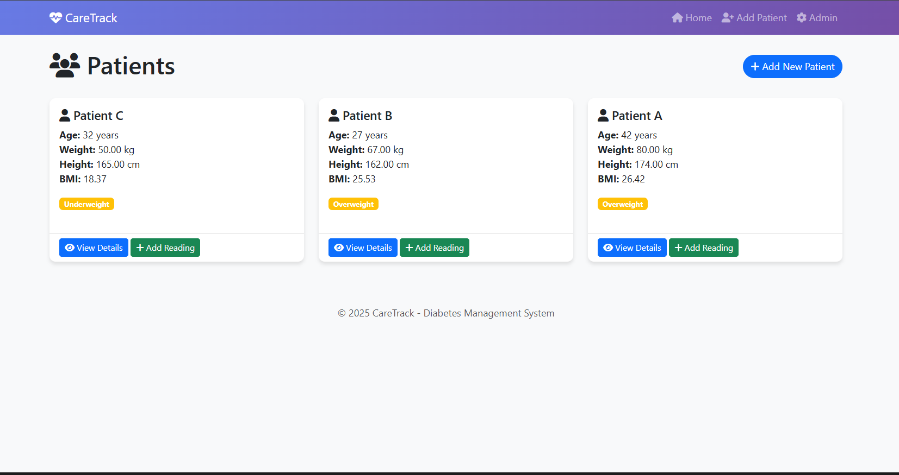
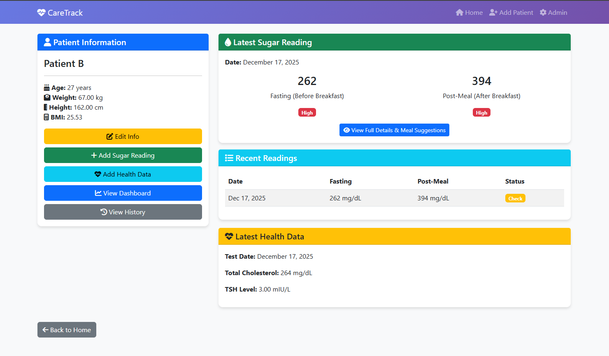
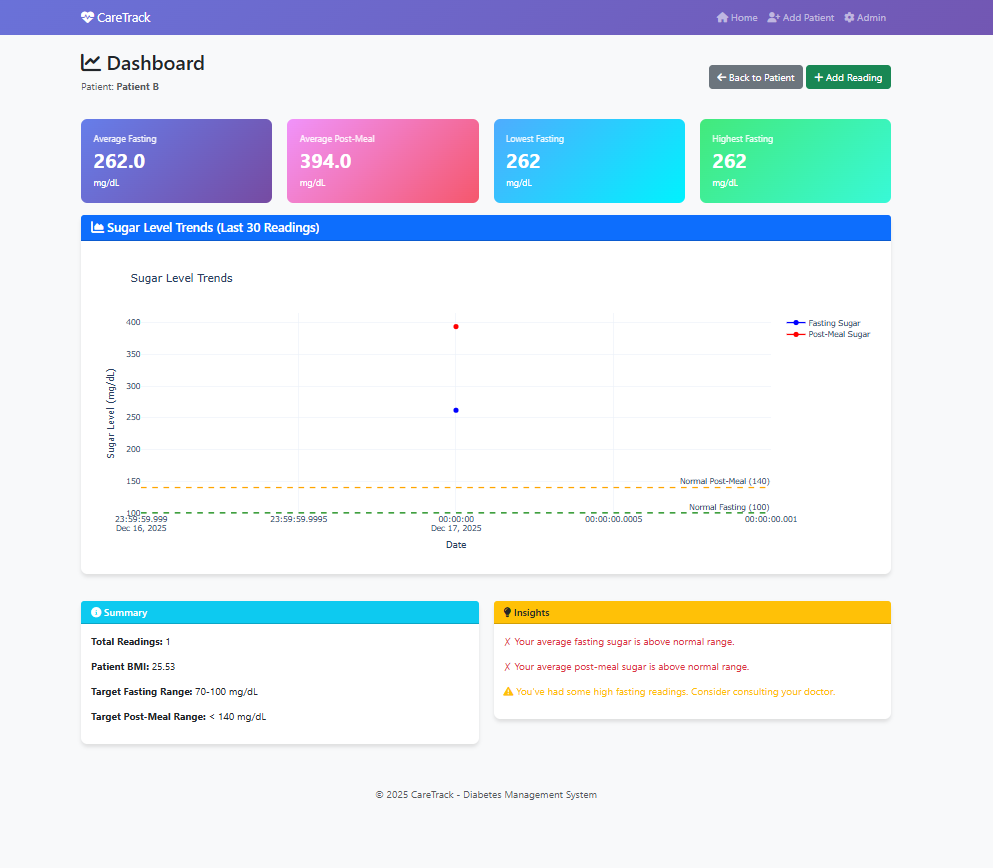

# 🏥 CareTrack - Diabetes Management System

A Django-based full-stack web application developed to record, manage, and visualize blood sugar data with rule-based diet suggestions and interactive dashboards.
This project was built for learning, demonstration, and portfolio purposes.


## 🌟 Features

### Core Functionality
- ✅ **Patient Management** - Register and manage patient profiles with automatic BMI calculation
- ✅ **Blood Sugar Tracking** - Record fasting and post-meal glucose levels with date tracking
- ✅ **Interactive Dashboards** - Visualize sugar trends with beautiful Plotly graphs
- ✅ **Personalized Diet Plans** - Get customized meal recommendations based on your readings
- ✅ **Health Metrics** - Track cholesterol and thyroid levels
- ✅ **Historical Records** - View complete reading history with color-coded status indicators
- ✅ **Admin Panel** - Comprehensive data management interface

### Advanced Features
- 📊 Interactive line charts for trend analysis
- Time-based meal suggestions (breakfast to bedtime)
- 📈 Summary statistics (average, min, max values)
- 🎨 Responsive UI compatible with desktop and mobile
- 📱 Bootstrap 5 based mobile-friendly design


## 📸 Project Screenshots

### Patients List


### Patient Details


### Dashboard & Charts



Screenshots help recruiters quickly understand the project flow and UI.

## 🛠️ Technologies Used

### Backend
- **Python 3.8+**
- **Django 4.2** - Full-stack web framework
- **SQLite** - Lightweight database

### Frontend
- **HTML5, CSS3, JavaScript**
- **Bootstrap 5** - Modern responsive UI
- **Font Awesome** - Beautiful icons

### Libraries
- **Plotly** - Interactive charts and graphs
- **django-crispy-forms** - Improved form rendering
- **crispy-bootstrap4** - Bootstrap styling for forms

## 📦 Installation & Setup

### Prerequisites
```bash
Python 3.8 or higher
pip (Python package manager)
Git
```

### Quick Start

1. **Clone the repository**
```bash
git clone https://github.com/A-BhanuTeja/caretrack-diabetes-management.git
cd caretrack-diabetes-management
```

2. **Create virtual environment**
```bash
# Windows
python -m venv venv
venv\Scripts\activate

# Mac/Linux
python3 -m venv venv
source venv/bin/activate
```

3. **Install dependencies**
```bash
pip install -r requirements.txt
```

4. **Run database migrations**
```bash
python manage.py makemigrations
python manage.py migrate
```

5. **Create superuser (admin account)**
```bash
python manage.py createsuperuser
# Follow the prompts to set username and password
```

6. **Run the development server**
```bash
python manage.py runserver
```

7. **Access the application**
- **Main Application:** http://127.0.0.1:8000/
- **Admin Panel:** http://127.0.0.1:8000/admin/

## 🚀 Usage

1. Create patient profiles
2. Add daily fasting and post-meal sugar readings
3. View charts and historical trends
4. See sample diet suggestions based on recorded values
5. Manage records using Django admin

## 📊 Project Structure
```
caretrack-diabetes-management/
├── CareTrack/              # Project settings
│   ├── settings.py
│   ├── urls.py
│   └── wsgi.py
├── app/                    # Main application
│   ├── models.py          # Database models
│   ├── views.py           # Business logic
│   ├── forms.py           # Form definitions
│   ├── diet_plans.py      # Diet recommendation engine
│   ├── admin.py           # Admin configuration
│   ├── templates/         # HTML templates
│   └── migrations/        # Database migrations
├── manage.py              # Django management script
├── requirements.txt       # Python dependencies
├── LICENSE               # MIT License
└── README.md            # This file
```

## 💡 Key Features Explained

- Django ORM for database operations
- Form handling and validation
- Data visualization using Plotly
- Rule-based logic for recommendations
- CRUD operations
- Responsive UI with Bootstrap


## 🚀 Future Enhancements

Planned features for future versions:

- [ ] User authentication & role-based access
- [ ] Export reports (CSV / PDF)
- [ ] UI/UX enhancements
- [ ] Deployment on cloud platform


## 📝 License

This project is licensed under the MIT License - see the [LICENSE](LICENSE) file for details.

This means you can freely use, modify, and distribute this software.

## 👨‍💻 Developer

**Bhanu Teja Amudala**
- GitHub: [@A-BhanuTeja](https://github.com/A-BhanuTeja)
- LinkedIn: [Connect with me](https://www.linkedin.com/in/bhanuteja79/) 
- Email: bhanu44223@gmail.com

*2024 Computer Science Graduate | Python Full-Stack Developer*


## ⭐ Show Your Support

If you found this project helpful or interesting, please give it a star! ⭐


